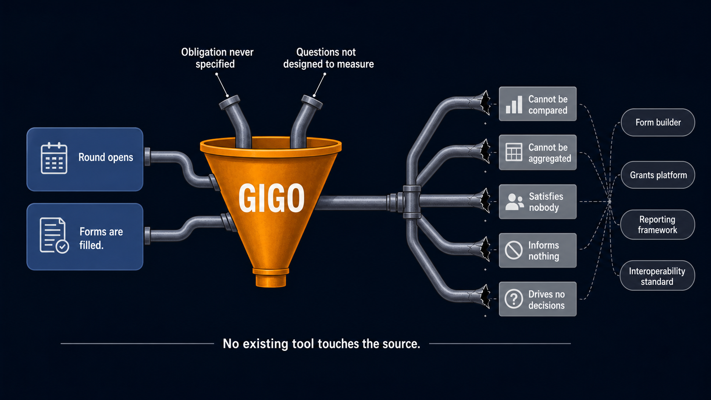

# WALKRI: Working Architecture for Legible, Knowledge-Ready Intake

Version 0.1.4 | 2026-05-18 | CC0

**Two standards. One problem.**

Every intake form has questions. No standard has ever required those questions to function as measurement instruments before anyone answers them. WALKRI is the first.

A field that does not specify what it measures is a label. Labels produce responses. They do not produce data. The difference matters at every layer of the grants ecosystem: a reviewer cannot assess what was not defined, an analyst cannot aggregate what was not measured consistently, and a funder cannot verify what was never specified. WALKRI addresses this at the source, before any applicant sees the form.

WALKRI is a companion standard to CROSS (Common Reporting Outcome Standards Schema). Together they are published as CROSS+WALKRI. CROSS specifies the obligation architecture of a grants round: what grantees must demonstrate at each payment gate. WALKRI specifies the quality of the fields through which that demonstration is collected. The two are designed to be used together, but WALKRI is also portable: it works with any obligation standard, not only CROSS.

---

## The label problem

The same question can be a label or a measurement instrument depending on how it is specified. The difference determines whether the data it produces is trustworthy.

**Label version:** "Is this project open source?"

This question produces a yes/no response and nothing else. Two programs asking it will produce incomparable answers because "open source" means different things to different applicants. A reviewer cannot assess it consistently. An analyst cannot aggregate across it. An auditor cannot verify it.

**Instrument version:** "Does the primary codebase have a published OSI-approved license in the root directory of the public repository? Qualifying licenses: MIT, Apache 2.0, GPL, AGPL, MPL, or equivalent. Non-qualifying: 'available on request', 'will be open sourced post-launch', business source license. Evidence required: direct URL to the LICENSE file in a publicly accessible repository."

This version measures what the question claims to measure. A reviewer knows exactly what passes. An applicant knows exactly what evidence to provide. Two reviewers reach the same judgment from the same answer. The data is aggregatable across every program that specified the field correctly.

WALKRI applies this transformation to every intake field, for any question in any domain.

---

## What WALKRI specifies

Five requirements apply to every intake field before any applicant sees it.

**Criterion intent:** The field must specify what it measures, not just what it asks. The intent is a written statement, distinct from the label, that names the underlying construct being assessed.

**Operational definition:** The field must define the unit of measurement or the categories of valid response. For a quantitative field, this means the unit and scale. For a qualitative field, this means the qualifying and non-qualifying examples that constrain interpretation.

**Response form:** The field must specify the type of response required and provide a written justification for why that response type is appropriate for the criterion intent. A field asking for a URL when a narrative is needed is measuring the wrong thing in the wrong way.

**Evidence form:** The field must identify the specific artifact type and access path required to answer it. Not "evidence of open source status" but "a URL to the LICENSE file in the root directory of a publicly accessible repository." The evidence form structurally separates what counts as evidence from who benefits from favorable assessment.

**Compliance threshold:** For fields referencing external standards (a DPG Standard, ISO certification, a regulatory requirement), the field must enumerate which components of the standard apply and what minimum passage level constitutes compliance.

A field that satisfies all five is a measurement instrument. A field that fails any one is a label. The distinction is structural, not a matter of degree.

WALKRI also specifies five gate declaration instruments that apply at the program level, before individual fields are designed: the Obligation Mode Declaration, the Evidence Standard Declaration, the Comparison Frame Declaration, the Attribution Claim Declaration, and the Sufficiency Assessment Declaration. These establish the accountability context that field design must satisfy.

---

## What conformant fields produce

Field quality at the specification stage compounds upward through every layer of the grants ecosystem. Here is what each layer gains.

**Grantees** know exactly what a field requires before they write a word. The operational definition includes qualifying and non-qualifying examples. The compliance threshold states what passage looks like. Professional grant writers no longer have a structural advantage over subject matter experts, because the form itself carries the information previously available only to experienced applicants.

**Reviewers** get calibration built into the field rather than requiring separate calibration sessions. Two reviewers reading the same operational definition reach consistent judgments. Scoring variance is a structural consequence of underspecified fields; WALKRI eliminates the source rather than training reviewers to manage it. The compliance threshold makes reviewer disagreement a traceable discrepancy, not an irresolvable difference of opinion.

**Program operators** can audit their own fields before a round opens. A field flagged as a label by the WALKRI rubric can be specified correctly in hours. A label that went live and collected a round of responses cannot be fixed retroactively. The pre-publication audit is the only point in the process where this correction costs nothing.

**Analysts** get data that is structurally comparable across programs. Ten programs asking WALKRI-conformant versions of "is this open source?" produce data that aggregates directly. Ten programs asking label versions of the same question produce ten different constructs that look identical but are not. Portfolio analysis, cross-program benchmarking, and longitudinal tracking all depend on the conformant version.

**AI-assisted review** becomes criterion-referenced rather than pattern-matched. A language model assessing a response against a WALKRI-conformant field specification is working with defined criteria, qualifying examples, an evidence requirement, and a compliance threshold. Without WALKRI, AI review is inferring intent from a label. With it, AI review is applying a specification. The difference is not in the model; it is in whether the field gives the model something precise to assess against.

**Platform providers** gain ecosystem-wide data comparability from a single conformance requirement. Every program running on a WALKRI-conformant platform produces data that is structurally comparable to every other program, regardless of what the programs fund, how they select, or which indicators they use.

**Institutional funders** receive data quality as a structural output of the round being run correctly, not as a separate compliance exercise. USAID data quality criteria, OECD DAC evaluation standards, IRIS+ metadata requirements, and FAIR data principles are all satisfied as consequences of conformance. The same applies in the Web3 ecosystem: DAOIP-5-compatible grant data, EAS-attestable field specifications, and OpenGrants-compatible structured output are all products of the same conformant specification.

---

## Where WALKRI sits in the stack

WALKRI operates on JSON Schema, which underlies every major form builder. Fillout, Typeform, KoBoToolbox, REDCap, Charmverse, and any comparable tool already output JSON Schema. A WALKRI-conformant field specification produced in any of those tools is equally conformant as one produced in a dedicated audit instrument. Programs do not change their stack. They specify their fields correctly before the form goes live.

Above the field level, a CROSS+WALKRI-conformant round produces data that is structurally comparable across programs and auditable after the fact. That position in the stack is why compatibility is the primary benefit: it does not require replacing what exists below, and it makes everything built above interoperable with everything else built on the same foundation.

Both CROSS and WALKRI are published CC0. No licensing, no arrangements, no asks.

---

## Who this is built for

WALKRI serves all six layers of the grants ecosystem without modification. The field quality it requires at the intake layer compounds upward: better specified fields produce better applicant responses, more consistent reviewer assessments, more defensible funding decisions, more trustworthy portfolio data, and eventually better strategic allocation decisions at the top of the stack.

The strategic planning benefit requires ecosystem-wide adoption to materialise. The base-layer benefits, for grantees and reviewers, are immediate from the first conformant round.

---

## Ecosystem position

| Tool / Standard | Layer | Obligation architecture | Field quality | Web3 output | Institutional output |
|:--|:--|:--|:--|:--|:--|
| **WALKRI** | Specification | n/a (see CROSS) | Five pre-publication field requirements | n/a | USAID DQA, FAIR, OECD DAC, IRIS+ |
| **CROSS** | Specification | Three modes, four-gate sequence | n/a (see WALKRI) | DAOIP-5, W3C VCs, OpenGrants | OECD DAC, IRIS+, USAID PIRS |
| [USAID PIRS](https://2017-2020.usaid.gov/sites/default/files/documents/1861/Recommended_PIRS_for_USAID_indicators_0.pdf) | Compliance framework | n/a | Five data quality criteria (retrospective) | n/a | Required indicator documentation |
| [IRIS+](https://iris.thegiin.org/standards/) | Vocabulary | n/a | n/a | n/a | Indicator reference library |
| [Logframe / LFA](https://www.oecd.org/en/topics/sub-issues/development-co-operation-evaluation-and-effectiveness/evaluation-criteria.html) | Methodology | ToC hierarchy only | n/a | n/a | OECD DAC (partial) |
| [KarmaGAP](https://docs.gap.karmahq.xyz/) | Post-funding tracking | n/a | n/a | EAS milestone attestations | n/a |
| [DAOIP-5](https://github.com/metagov/daostar/blob/main/DAOIPs/daoip-5.md) | Interoperability | n/a | n/a | Grants data portability | n/a |
| Form builders (Fillout, Typeform, KoBoToolbox, REDCap) | Collection layer | n/a | n/a | JSON Schema output | n/a |

Every tool either collects data after fields are defined, tracks outcomes after work is done, provides indicator vocabulary, or handles interoperability. None specify what makes a field a measurement instrument before it is published. WALKRI is the first standard that does.

---

## Institutional alignment

WALKRI's five requirements encode the same underlying measurement quality principles that institutional frameworks require, applied at specification time rather than assessed retrospectively.

**USAID data quality criteria** (Validity, Reliability, Precision, Integrity, Timeliness) map directly to WALKRI's five requirements. USAID applies these as a Data Quality Assessment procedure after data is collected. WALKRI applies them at the field specification stage, before any applicant sees the form. A WALKRI-conformant field satisfies the USAID DQA without a separate assessment.

| USAID criterion | WALKRI requirement | How WALKRI satisfies it |
|:--|:--|:--|
| Validity | Criterion intent + Operational definition | Written statement of what the field measures with qualifying and non-qualifying examples |
| Reliability | Operational definition + Compliance threshold | Precise definition constrains interpretation; calibration requirement ensures consistency across reviewers |
| Precision | Response form | Response type justified as appropriate for the criterion intent; determines measurement resolution |
| Integrity | Evidence form | Specifies artifact type and independent access path, separating evidence from beneficiary |
| Timeliness | Evidence form | Specifies recency requirement and time-period for evidence collection |

**FAIR data principles** (Findable, Accessible, Interoperable, Reusable) are satisfied as a consequence of WALKRI conformance. Conformant field specifications are machine-readable, linked to defined vocabularies, and structurally consistent across programs, making the data they produce FAIR without additional effort.

**OECD DAC evaluation criteria** require that evaluation questions be traceable to defined program logic. WALKRI-conformant fields are designed against the obligation architecture declared in CROSS, ensuring that the measurement surface is coherent with the causal theory being evaluated.

**IRIS+ metadata requirements** for indicator documentation are satisfied by the combination of WALKRI field specifications and CROSS indicator declarations. IRIS+-compatible indicator records are produced as structural outputs of a conformant round.

The formal compatibility statement is in `statements/USAID-PIRS-CROSS-WALKRI-compatibility-0_1_0.md`.

---

## Documents

- `WALKRI-standard-0_1_4.md` - Main specification
- `WALKRI-interface-specification-0_1_0.md` - Three-interface specification (upward, lateral, downstream)
- `WALKRI-CROSS-boundary-0_1_0.md` - Formal boundary between WALKRI and CROSS
- `WALKRI-guidance-0_1_2.md` - Practitioner guidance including gate declaration instrument guidance
- `WALKRI-templates-0_1_2.md` - Field specification templates, worksheets, and gate declaration forms
- `WALKRI-rubric-0_1_2.md` - Audit and certification rubric with gate declaration assessment
- `WALKRI-worked-examples-0_1_2.md` - Worked examples from Epoch 12 and comparable programs

---

## License

CC0: dedicated to the public domain under Creative Commons Zero v1.0 Universal. See `LICENSE` for the full dedication.

Any grants ecosystem can adopt WALKRI without adopting CROSS, the Coordination Structural Integrity Suite, or any other standard. The five field requirements and gate declaration instruments stand alone.
